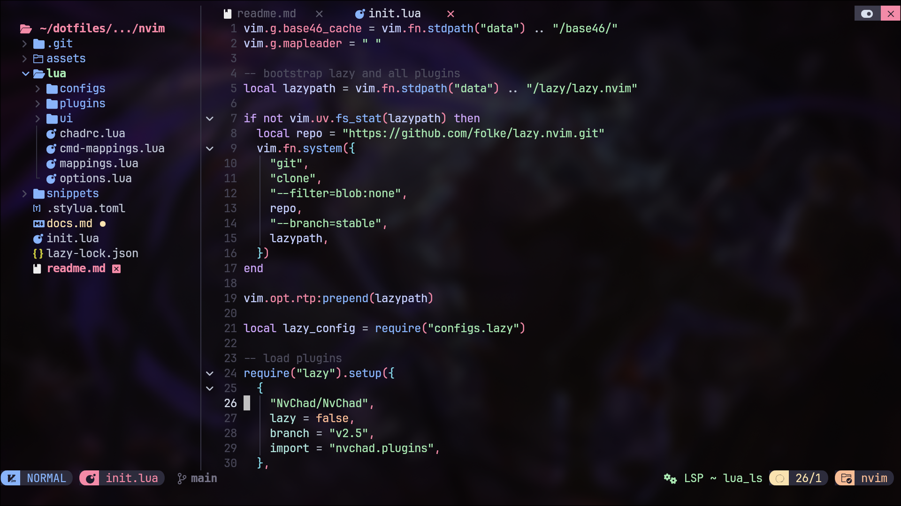
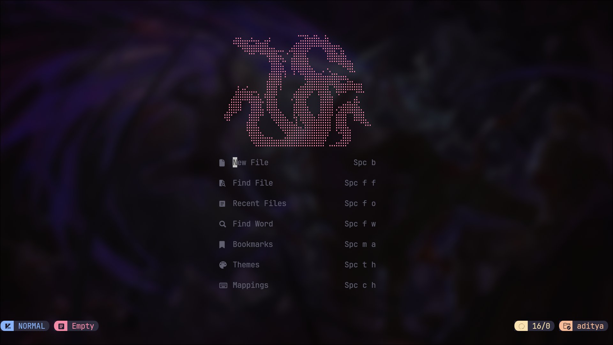
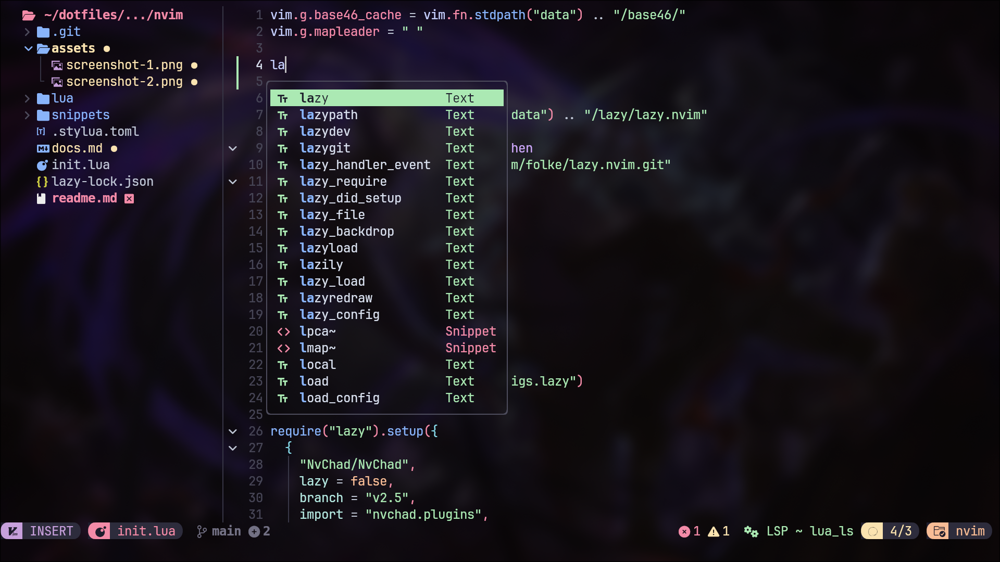

<h1 align="center">🌟 My Neovim Configuration 🌟</h1>

This is my custom Neovim configuration based on [NvChad 2.5](https://nvchad.com/). It provides a modern and efficient
development environment with additional plugins and tweaks.

## Showcase




- To see more features visit [NvChad/features](https://nvchad.com/docs/features) 

## Requirements

Make sure you have the following dependencies installed:

- **Neovim** (version 0.10+)
- **Node.js** and **npm** (for LSP and plugin support)
- **ripgrep** (for better searching capabilities)
- **Any Nerd Font** (for proper icon rendering in the UI)

### Installing Dependencies
If you use arch like me here is the command for installing all the dependencies:

```sh
sudo pacman -S neovim nodejs npm ripgrep ttf-jetbrains-mono-nerd
```
## Installation

1. Backup or Delete your existing Neovim configuration:
```sh
# Backup your config
mv ~/.config/nvim ~/.config/nvim.backup
rm -rf ~/.local/state/nvim
rm -rf ~/.local/share/nvim

# Or delete your config
rm -rf ~/.config/nvim
rm -rf ~/.local/state/nvim
rm -rf ~/.local/share/nvim
```

2. Clone NvChad into your Neovim configuration directory:
```sh
git https://github.com/s-adi-dev/nvim.git ~/.config/nvim --depth 1
```

3. Start Neovim and let it install the plugins:
```sh
nvim
```

4. Customize your configuration inside `~/.config/nvim/`.

## Usage

- Open Neovim:
```sh
nvim
```
- Use `:q` to quit, `:w` to save, and `:q!` to force quit.
- Press `<Space>` to open which key menu.
- Press `<Space>ch` to open cheatsheet.


## Additional Configuration
For additional customization options, refer to the official NvChad Documentation: [NvChad Docs](https://nvchad.com/docs/) as well as my personal configuration [docs](./docs.md).
